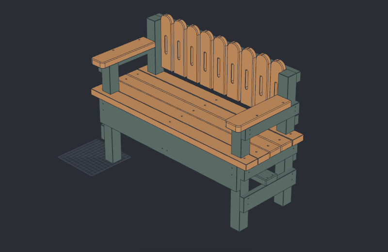
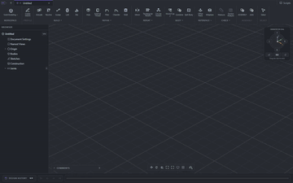
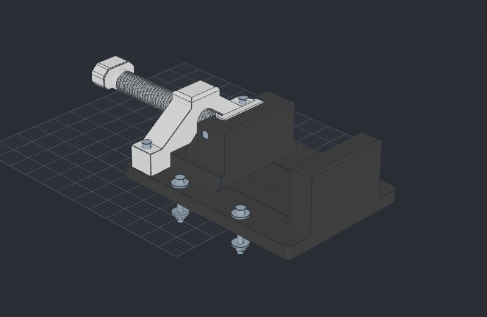
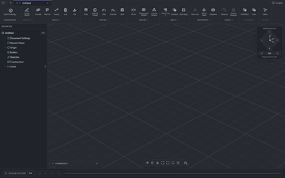
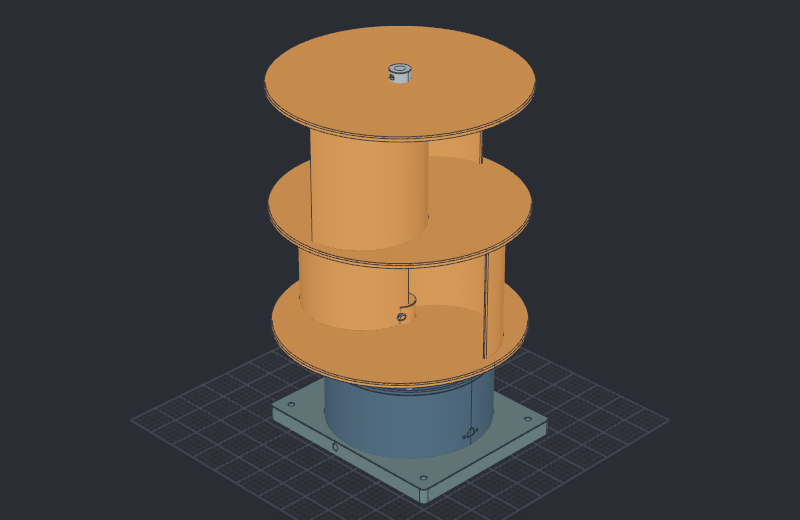
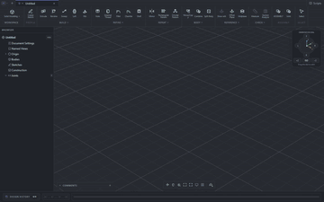

# noBS CAD

Free, open-source parametric CAD for mechanical parts, assemblies and drawings.
Design locally, keep editable files, and work by hand or with your own MCP agent.

**Pre-alpha · Planned showcase preview 2026-09-12.2**
· [Build and checks](https://github.com/jackControls/noBS-CAD/releases/tag/preview-2026-09-12.2)
· [Installation help](docs/INSTALL.md)

> **Publication pending.** The showcase update below is under review. Its package, video and editable-model downloads are not yet public; the recipe-link installation also requires this update. The [older public preview](https://github.com/jackControls/noBS-CAD/releases/tag/preview-2026-09-12) is available now and does not include the latest changes.

**Download:** [Windows x64](https://github.com/jackControls/noBS-CAD/releases/download/preview-2026-09-12.2/noBS-CAD-0.1.0-windows-x64.zip)
· [Windows ARM64](https://github.com/jackControls/noBS-CAD/releases/download/preview-2026-09-12.2/noBS-CAD-0.1.0-windows-arm64.zip)
· [macOS Apple silicon](https://github.com/jackControls/noBS-CAD/releases/download/preview-2026-09-12.2/noBS.CAD_0.1.0_aarch64.dmg)
· [Ubuntu 26.04 DEB](https://github.com/jackControls/noBS-CAD/releases/download/preview-2026-09-12.2/noBS.CAD_0.1.0_amd64.deb)
· [AppImage](https://github.com/jackControls/noBS-CAD/releases/download/preview-2026-09-12.2/noBS.CAD_0.1.0_amd64.AppImage)

No CAD account, subscription or cloud service is required. Keep backups of important projects while the application is pre-alpha.

## Made in noBS CAD

These designs were built from blank documents through MCP. Their sketches,
features and assembly relationships remain editable. The small loops are
accelerated excerpts; the player pages describe the longer recordings.

### Garden bench

Change one picket dimension and the repeated back updates. The timber frame,
shaped arms and assembly joints stay editable.

[Enlarge image](docs/assets/showcase/bench.png)
· **[Watch in player](https://jackcontrols.github.io/noBS-CAD/showcase.html#garden-bench)**
· [Download MP4](https://github.com/jackControls/noBS-CAD/releases/download/preview-2026-09-12.2/bench-build-full.mp4)

[Open editable recipe in CAD](https://jackcontrols.github.io/noBS-CAD/open.html#garden-bench)
· [Recipe source](examples/scripts/garden-bench.nbcad.jsonc)
· [Download editable model (.nbcad)](https://github.com/jackControls/noBS-CAD/releases/download/preview-2026-09-12.2/bench.nbcad)

<!-- Print photo: add docs/assets/showcase/bench-printed.jpg when supplied. -->

### Vise

Turn the screw and watch the jaw follow, then inspect the captured guides and
carriage drawing. 100 mm jaws, 90 mm travel; six printed parts plus standard hardware.

[Enlarge image](docs/assets/showcase/vise.png)
· **[Watch in player](https://jackcontrols.github.io/noBS-CAD/showcase.html#d-screw-vise)**
· [Download MP4](https://github.com/jackControls/noBS-CAD/releases/download/preview-2026-09-12.2/vise-build-full.mp4)

[Open editable recipe in CAD](https://jackcontrols.github.io/noBS-CAD/open.html#d-screw-vise)
· [Recipe source](examples/scripts/d-screw-vise.nbcad.jsonc)
· [Download editable model (.nbcad)](https://github.com/jackControls/noBS-CAD/releases/download/preview-2026-09-12.2/vise.nbcad)

<!-- Print photo: add docs/assets/showcase/vise-printed.jpg when supplied. -->

### Vertical-axis turbine

Expose the 4:1 generator drive, turn the coupled shafts, then restore the guard.
Two staggered Savonius stages sit on a bearing-supported shaft.

[Enlarge image](docs/assets/showcase/turbine.png)
· **[Watch in player](https://jackcontrols.github.io/noBS-CAD/showcase.html#vertical-axis-turbine)**
· [Download MP4](https://github.com/jackControls/noBS-CAD/releases/download/preview-2026-09-12.2/turbine-build-full.mp4)

[Open editable recipe in CAD](https://jackcontrols.github.io/noBS-CAD/open.html#vertical-axis-turbine)
· [Recipe source](examples/scripts/vertical-axis-turbine.nbcad.jsonc)
· [Download editable model (.nbcad)](https://github.com/jackControls/noBS-CAD/releases/download/preview-2026-09-12.2/turbine.nbcad)

<!-- Print photo: add docs/assets/showcase/turbine-printed.jpg when supplied. -->

Recipe links load source into **Scripts** for review before running. To inspect
a completed design immediately, download its `.nbcad` and use **File → Open**.
These are development examples; physical fit and load qualification remain open.
[Designs, drawings and validation](docs/flagship-examples.md) · [All recipes](examples/scripts/README.md)

## Make your first part

After [installing CAD](docs/INSTALL.md), open **Scripts**, choose
**Sketch, extrude, ease the edges**, and select **Run in new design**.
The lesson builds a 60 × 30 × 12 mm block with rounded top edges.

When it finishes, double-click the extrusion in the feature history and change
its **Distance** from **12 to 18 mm**. Save the result as `first-part.nbcad`,
then reopen it to continue editing. [Step-by-step instructions](docs/INSTALL.md#make-your-first-part)

## Design, assemble, draw

Constrained sketches and reference geometry drive editable solid features.
Reuse parts in assemblies, define joints and check their motion and interference.
Keep the parts, assemblies and drawings together in one `.nbcad` project.

Assign per-body materials and colors, then export **3MF** for your slicer.
Material labels and color metadata assist the handoff; choose the actual print
profile in the slicer. **STEP** carries exact geometry and **STL** supplies mesh
export. Drawing sheets export to **DXF** and print/PDF.
[Assemblies](docs/ASSEMBLIES.md) · [Drawings and export coverage](docs/2D_DRAWINGS.md)

## Work with an agent

The installed application includes a local MCP server. Bring your preferred
MCP-compatible agent and model to build a part, edit an existing feature, inspect
an assembly or replay a demonstration. CAD keeps the same editable project
whether you use the tools yourself or ask an agent to use them.

[Connect your agent](docs/INSTALL.md#connect-an-mcp-agent), then try:

> Use noBS CAD to run the fillet-basics lesson in a new design in the open CAD
> window. Preserve my existing documents. After the final checks pass, change
> the stock extrusion from 12 to 18 mm, inspect the result and keep it open.

An agent is optional. **Scripts** can build a bundled example, explain its
chapters and show the construction with captions, camera moves and playback
controls. You can inspect and edit the recipe before running it.
[MCP interface](mcp-server/README.md) · [Recipes and playback](docs/native-scripts.md)
· [Engineering knowledge](knowledge/index.md)

## Help build it

Contributions are welcome. Our priorities are **reliability, performance and
ease of use**, in that order. Bring a part, a reproducible bug or a focused
improvement. [Contributing](CONTRIBUTING.md) · [Developer setup](docs/DEVELOPMENT.md)
· [Documentation](docs/INDEX.md)

We are working toward guided design lessons and conversational wizards, and
exploring **3-axis CAM**. Toolpath generation and strength analysis are future
capabilities. [Project direction](docs/goals.md)

## Open-source foundations

- **[Open CASCADE Technology](https://github.com/Open-Cascade-SAS/OCCT)** — geometry and CAD interchange.
- **[Bevy](https://bevy.org/) and [wgpu](https://wgpu.rs/)** — native rendering.
- **[Rust](https://rust-lang.org/)** — modeling, assemblies and recipe execution.
- **[Tauri](https://tauri.app/) and [React](https://react.dev/)** — desktop shell and interface.
- **[OpenCascade.js](https://github.com/donalffons/opencascade.js)** — browser development builds.

Thanks also to [FreeCAD](https://www.freecad.org/) and the wider open-source CAD community.

## License

[GNU LGPL 2.1 or later](LICENSE). Free to use, inspect and improve.

Third-party notices and 3D mouse support

Dependency licenses and attribution live in [Third-party notices](THIRD_PARTY_NOTICES.md).
Icon sources are recorded in [Icon provenance](docs/ICON_PROVENANCE.md).
Peer CAD projects have their own licenses; see [contribution guidance](CONTRIBUTING.md#license--borrow).

noBS CAD supports 3Dconnexion SpaceMouse devices. The optional browser-development
driver bridge loads only after the user enables it.
noBS CAD is independent and is not affiliated with, endorsed by or certified by
3Dconnexion. 3Dconnexion and SpaceMouse are trademarks or registered trademarks
of 3Dconnexion. 3D input device development tools and related technology are
provided under license from 3Dconnexion. © 3Dconnexion 1992–2020. All rights reserved.

