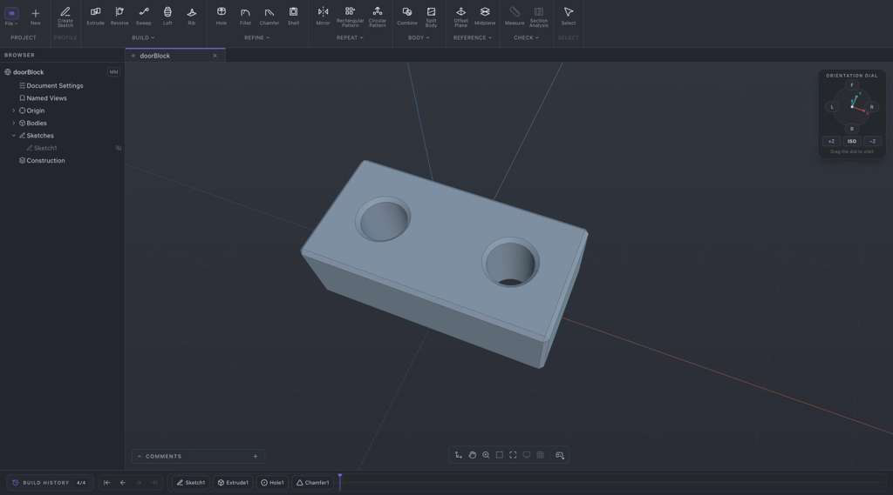
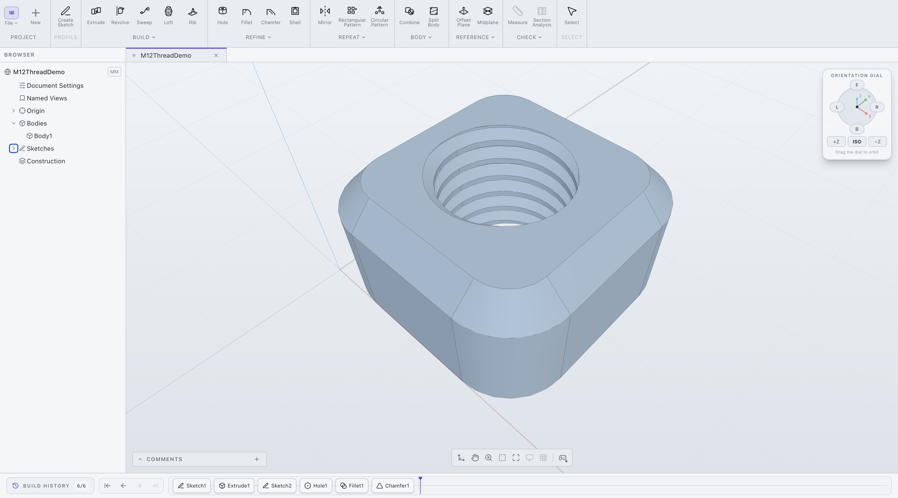

# noBS CAD

**noBS means no cloud, no BS.** noBS CAD is fully local,
fully free, and fully open source. It is designed first for mechanical parts,
around the familiar sketch-and-extrude workflow.

> noBS CAD is currently pre-alpha.



*A simple test piece modeled in noBS CAD. Download the editable
[`testPiece.nbcad`](examples/testPiece.nbcad) project or its
[`testPiece.step`](examples/testPiece.step) geometry backup.*



*Fillet, chamfer, and a modeled M12 threaded hole shown together in the
editable feature history.*

## Why this project exists

We are grateful for projects such as [FreeCAD](https://www.freecad.org/) and
for the community work that proved open-source CAD can be serious and useful.
At the same time, we would love an option with a gentler learning curve and
the kind of clear, modern experience people have come to expect from
commercial and cloud CAD platforms.

That is the direction we are exploring with noBS CAD:

- project and modeling data stay on your computer;
- there is no account, subscription, or cloud backend;
- the complete source is public under an open-source license;
- the software is free to use;
- mechanical-part workflows are the priority.

## What works today

noBS CAD can already make solid models. Right now it is happiest making
relatively simple boxy and cylindrical parts, but the best way to understand
the real boundary is to try building something for the real world.

The current application includes early implementations of:

- parametric sketches with dimensions and geometric constraints;
- extrude, revolve, sweep, loft, rib, hole, fillet, chamfer, and shell
  features;
- mirrors, patterns, construction planes, combine, and split-body tools;
- editable feature history, undo, project saving, and reopening;
- local `.nbcad` project files (ZIP archives containing editable model data
  and metadata);
- STEP import and AP242 STEP export.

Not every tool or combination is reliable yet. We would especially like
people to try real mechanical parts and whatever else is useful to you. Tell
us where the workflow becomes confusing, where the geometry fails, and which
missing capability would help most.

The `.nbcad` format may still change during pre-alpha, so we recommend
exporting a STEP copy of any design you care about as a backup. STEP preserves
the final solid geometry for use in other CAD software, but not the editable
noBS CAD feature history.

## An MCP server for CAD automation

The repository also includes a stateful, headless
[MCP server](mcp-server/README.md) that covers most currently implemented
sketch and solid-modeling tools. It exposes 101 granular tools today, keeps one
persistent feature history per process, and uses the same Rust planning model
and native geometry adapter as the desktop application.

This is useful for testing, automation, and experimenting with agent-driven
CAD workflows without turning the project into a cloud service.

## Bevy viewport spike (experimental)

An isolated Bevy **0.19** display/ECS spike lives in
[`crates/bevy_viewport`](crates/bevy_viewport) (issue
[#20](https://github.com/jackControls/noBS-CAD/issues/20)). It does **not**
replace the Three.js viewport or OCCT. Launch desktop or wasm with:

```bash
cargo run -p nbcad-bevy-launcher
# [1] desktop  |  [2] experimental (wasm)
```

**Guide (humans + agents):** [`docs/bevy-viewport/README.md`](docs/bevy-viewport/README.md)

## 3D mouse compatibility

noBS CAD is compatible with 3Dconnexion SpaceMouse devices. In the browser
development build, the optional hosted 3Dconnexion driver bridge is loaded
only after the user clicks the 3D-mouse control; it is not downloaded during
ordinary startup.

noBS CAD is an independent project and is not affiliated with, endorsed by, or
certified by 3Dconnexion. 3Dconnexion and SpaceMouse are trademarks or
registered trademarks of 3Dconnexion.

3D input device development tools and related technology are provided under
license from 3Dconnexion. © 3Dconnexion 1992 - 2020. All rights reserved.

## We want your feedback

The most helpful contribution right now is simply trying to make a real part
and showing us what gets in the way.

For a bug, it helps to include:

- your operating system and the build you tested;
- the exact steps from a new project;
- what you expected and what happened instead;
- a screenshot or short recording for visual problems;
- a small `.nbcad` file when it is safe to share.

Feature requests are welcome too. We want to know what people actually need,
not just guess from a checklist of CAD commands. Please
[open an issue](https://github.com/jackControls/noBS-CAD/issues) with what you
find.

## Where we are going

Our near-term priorities are:

1. Make today's sketching, solid modeling, history, undo, and project-file
   workflows more dependable.
2. Add threaded and tapped options to Hole features.
3. Keep improving general UX.
4. Improve preview, selection, and recompute performance.
5. Turn reported failures into focused regression tests.

In the longer run, we prefer a true native desktop experience. The browser
build is valuable for development and automated testing, but it is not the
intended final product experience.

We would also like to explore a functional, modern CAM workflow for 3-axis
machines. We know that is ambitious and difficult, so we plan to approach it
carefully: start with research and testable pieces, listen to machinists, and
earn trust one operation at a time. We would love to hear from CAM experts!

## Build locally

### Windows x64 portable build

The Windows release path targets Windows 10 version 1803 or newer and Windows
11. It produces a portable ZIP rather than an installer, uses the WebView2
runtime supplied by Windows, and requires Microsoft's centrally installed
Visual C++ v14 x64 Redistributable.

The build itself requires Windows, Visual Studio C++ Build Tools, the Windows
SDK, Rust, Node.js, `wasm-pack`, and the pinned OCCT 7.9.3 vcpkg dependency.
After installing the pinned vcpkg manifest:

```powershell
$env:OCCT_ROOT = "$PWD\vcpkg_installed\x64-windows"
npm ci
npm run bundle:windows:portable
```

See [Windows portable packaging](docs/WINDOWS_PACKAGING.md) for the complete
setup, output layout, runtime requirements, and GitHub Actions workflow.

### Native macOS development bundle

The macOS packaging path uses Tauri with OCCT 7.9.x.

```sh
brew install opencascade wasm-pack
rustup target add wasm32-unknown-unknown
npm ci
npm run bundle:macos
```

The resulting application is written to:

```text
src-tauri/target/release/bundle/macos/noBS CAD.app
```

See [OCCT packaging and browser/WASM strategy](docs/OCCT_PACKAGING.md) for
native SDK overrides and packaging details.

### Browser development build

The browser build is a development and testing environment. It requires
Node.js, npm, a current Rust toolchain, the `wasm32-unknown-unknown` target,
and `wasm-pack`.

```sh
rustup target add wasm32-unknown-unknown
npm ci
npm run build:wasm
npm run dev
```

Open the local address printed by Vite. Create a production browser bundle
with:

```sh
npm run build
```

## Project structure

- React, TypeScript, Vite, and three.js provide the UI and viewport.
- Host-neutral Rust crates own project data, sketches, feature definitions,
  history, stable references, and recompute planning.
- Native builds use Open CASCADE Technology through a narrow C++ bridge.
- The browser development build uses the same Rust model through WebAssembly
  and OpenCascade.js for solid operations.
- `.nbcad` files are inspectable ZIP archives containing a manifest and model
  data.

Public technical references:

- [OCCT packaging and browser/WASM strategy](docs/OCCT_PACKAGING.md)
- [Windows portable packaging](docs/WINDOWS_PACKAGING.md)
- [MCP server](mcp-server/README.md)
- [Icon provenance](docs/ICON_PROVENANCE.md)
- [Generated WASM bundle](src/engine-wasm/README.md)

## Verify changes

Start with:

```sh
cargo test --workspace
npm run build:wasm
npm run build
npm run smoke:wasm
```

Browser regression suites run through Playwright. For example:

```sh
npm run e2e:m2
npm run e2e:hole
npm run e2e:timeline
```

Run the complete browser release regression set with:

```sh
npm run e2e:release
```

Native OCCT and MCP checks require a compatible local OCCT installation:

```sh
cargo test -p nbcad-occt --features native-occt
cargo test --manifest-path mcp-server/Cargo.toml
```

## Contributing

Bug reproductions, usability feedback, tests, documentation, and focused fixes
are all valuable. Please keep pull requests reasonably focused, explain the
user-visible problem or improvement, and add a regression test when the
behavior can be automated.

For a large feature, starting with a discussion will help us agree on the user
experience and model behavior before a lot of implementation work begins.

## License

noBS CAD is free and open-source software licensed under the
[GNU Library General Public License, version 2 or any later version](LICENSE)
(`LGPL-2.0-or-later`).

Third-party components retain their own licenses and notices; see
[Third-party notices](THIRD_PARTY_NOTICES.md).
