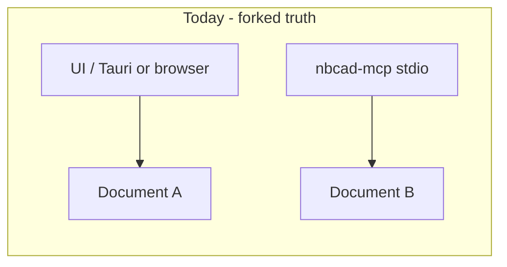
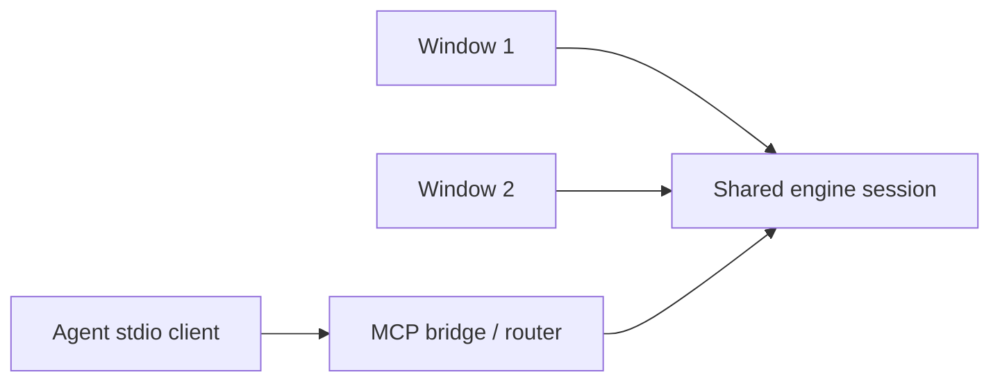

# Adversarial review — 2026-07-27

Generated by following [docs/prompts/ADVERSARIAL_REVIEW.md](../prompts/ADVERSARIAL_REVIEW.md).  
Scope: open PRs #6/#2/#5/#4, `main` (incl. Windows portable CI), public agentic/local CAD positioning.  
Environment note: this pass is **read/CI/docs-based**; full UI+MCP co-drive was not executed here — the in-the-loop plan below is written so it *can* be.

---

### Executive verdict

**Ship-with-changes** on the docs pack (#6 → #2 → #5 → #4), but **block any claim that agentic CAD is “done.”**  
The single biggest architectural hole: **MCP and UI are not co-linked**, and **multi-window is undefined** — today `nbcad-mcp` is a separate stdio process with its own document, `listChanged: false`, and ~101 static tools. Agents and humans can diverge instantly; two windows have no first-class MCP address. Without a session/window bridge and an in-the-loop CI path, the vision is brochure-ware.

---

### PR-by-PR adversarial notes

| PR | Verdict | Attack |
|----|---------|--------|
| **#6** goals + MCP harness docs | **Merge after light fix** | Strong direction (stdio, focus, `list_changed`). Still underplays **co-link** and **multi-window**. Add explicit “MCP without UI = fork of truth” warning. |
| **#2** process | **Merge** | Good issue/worktree/babysit loop. Weakness: no requirement that PRs prove **runnable** validation (MCP golden or e2e). Add a CONTRIBUTING checkbox: “ran X locally / CI job.” |
| **#5** ADRs | **Merge as Proposed** | Bevy/rename/simulation are fine as ADRs; do **not** let them jump the queue ahead of MCP co-link + 3MF materials. ADR 0006 must be extended for multi-window routing. |
| **#4** OKF + Pages | **Merge after #6** | Useful LLM wiki. Risk: Pages workflow deploys raw markdown; fine as v0. Sync MCP co-link + multi-window concepts into `knowledge/` after merge. |
| **#3** (closed) | Correctly superseded | — |

Merged **#1 Windows portable**: valuable proof GitHub Actions can build real artifacts — lean into it; do not pretend full matrix exists.

---

### Architecture attacks

#### Co-linked MCP ↔ UI (missing)

**Attack:** Agent “validates” via MCP while the user stares at a different history. That is not agentic CAD; that is two apps.

**Target:**

**Session binding (proposal to adopt next):**

| Field | Role |
|-------|------|
| `document_id` | Which `.nbcad` / in-memory doc |
| `window_id` | Which UI window is attached (optional for headless) |
| `focus` | sketch / solid / print / … (drives dynamic tools) |
| `attach` / `list_sessions` | MCP discovers live UI sessions |

Rules of engagement: one writer lock or OT/CRDT later; v1 = **explicit attach** + reject conflicting writes.

#### Multi-window (central, currently ignored)

- Docs/ADRs assume one MCP process ↔ one document.
- **Central requirement:** multiple open windows.
- stdio reality: one client↔one server subprocess. Options:

| Option | Pros | Cons |
|--------|------|------|
| A. One MCP per window | Simple | Agents must pick port/command; sprawl |
| B. One broker MCP routes to windows | One endpoint | Broker complexity; must speak window IDs |
| C. UI embeds MCP sidechannel; stdio is thin client | True co-link | Harder packaging |

**Recommendation:** **B for product**, with **A allowed for headless CI**. Broker is the multi-window story; headless stays single-doc for golden tests.

#### Focus-scoped tools

ADR 0006 is right; `main` still advertises `listChanged: false`. Until that ships, every agent tutorial that lists 101 tools is training the model to fail.

#### Gamified / education

Risk: badges on a broken fillet tool.  
Honest v1 “game loop”: **quest = golden MCP scenario** (box → hole → 3MF with color) scored by CI. Tutor layer narrates the same steps in UI. No loot boxes.

---

### In-the-loop validation plan

**Local (Cursor / human):**

1. `npm run dev` (or Tauri) — Window A.
2. Open second window/tab — Window B (even if limited today; document the gap).
3. Start `nbcad-mcp` stdio in MCP client.
4. **Today (honest):** MCP builds a parallel doc; use it only as engine probe.
5. **Target:** `cad_list_sessions` → `cad_attach` → UI updates live while MCP calls run; browser Playwright clicks ribbon **and** MCP extrudes same body.
6. Success: one body visible in UI after MCP extrude; undo in UI reflected in MCP status (or explicit conflict error).

**CI (lean on GitHub):**

| Job | Purpose |
|-----|---------|
| Existing `Windows portable` | Artifact + compile gate (keep) |
| `cargo test` workspace | Engine honesty |
| `mcp-server` test | Focus list snapshots + list_changed |
| Playwright subset | UI smoke on browser build |
| `mcp-golden` | Headless box/hole/3mf (no UI) |
| Future `co-link-smoke` | Only when bridge exists |

Branch protection: require engine + mcp tests before “required”; portable Windows can stay informative until stable.

**Browser tab + MCP simultaneously:** use Cursor browser / Playwright against Vite app **while** MCP client holds stdio — once co-link exists. Until then, CI must not claim co-link.

---

### CI/CD recommendations

- **Keep** `.github/workflows/windows-portable.yml` (PR + tag + dispatch).
- **Add** `ci-engine.yml`: `cargo test` on Ubuntu/macOS/Windows (OCCT matrix hard — start Ubuntu with documented OCCT, Windows via vcpkg cache already proven).
- **Add** `ci-mcp.yml`: build + test `mcp-server`; assert future `listChanged: true` contract tests.
- **Add** `ci-e2e-smoke.yml`: small Playwright set already in `npm run e2e:*`.
- Publish MCP binary as optional artifact next to portable ZIP for agent machines.
- Pages (#4): enable after merge; do not block engineering on pretty docs hosting.

---

### Licensing recommendations

- Declared **LGPL-2.0-or-later**; GitHub shows `NOASSERTION` — add proper `LICENSE` SPDX / `license` detection (ensure file matches LGPL-2.1+ or-later text you intend; verify Library GPL v2 file vs “or-later” claim).
- Document **borrow policy**: Open CAD Studio = GPL-3 → ideas/automation patterns OK; **no code copy** without counsel.
- Bevy / crates: track license compatibility in THIRD_PARTY notices when introduced.
- MCP binary distribution: LGPL obligations for linking — say so in README briefly.

---

### Ranked next PRs

1. **`feat(mcp): focus-scoped tools + listChanged`** — stop the 101-tool dump.  
2. **`feat(bridge): co-link MCP ↔ UI sessions`** — `list_sessions` / `attach` / document_id.  
3. **`feat(bridge): multi-window routing`** — window_id in broker; document multi-window as required.  
4. **`feat(export): 3MF with materials/colors`** — core additive goal.  
5. **`ci: engine + mcp required checks`** — lean into Actions; feed branch protection (#2).  
6. **`test: in-loop browser+MCP smoke`** — only after #2–3 bridge.  
7. **`docs: gamified tutor quests as golden scenarios`** — education without cringe.  
8. Bevy spike / rename — **after** harness co-link, not before.

---

### Kill list (stop saying until true)

- “Agents and UI share one live document” — **false today**.
- “MCP is focus-aware” — **false** (`listChanged: false`).
- “Multi-window agent control” — **unspecified**.
- “Simulation-ready” / “full CAM” — premature.
- “Borrow freely from Open CAD Studio” — **GPL; ideas ≠ code**.
- “Gamified CAD” as product copy without quest/CI meaning.

---

### Immediate doc patch suggestions (for #6 follow-up)

Add to `docs/mcp-harness.md`:

1. Co-link requirement + attach protocol sketch.  
2. Multi-window as central; broker vs per-window stdio.  
3. In-the-loop validation: browser + MCP together.  
4. Honest “today vs target” table including co-link row.
